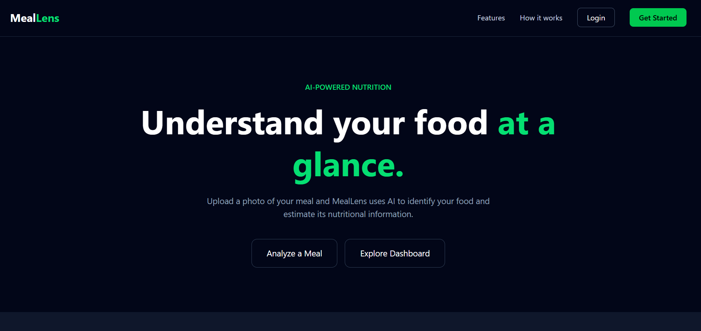
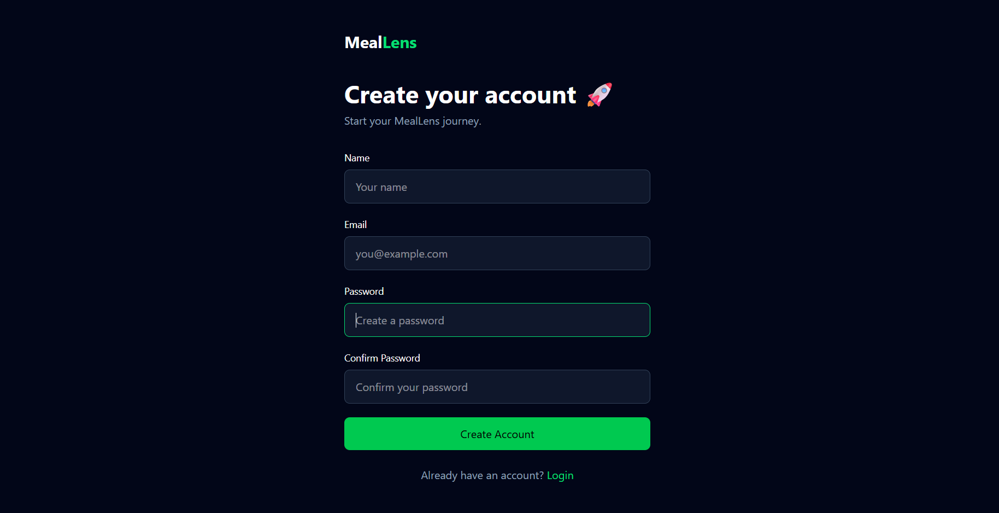
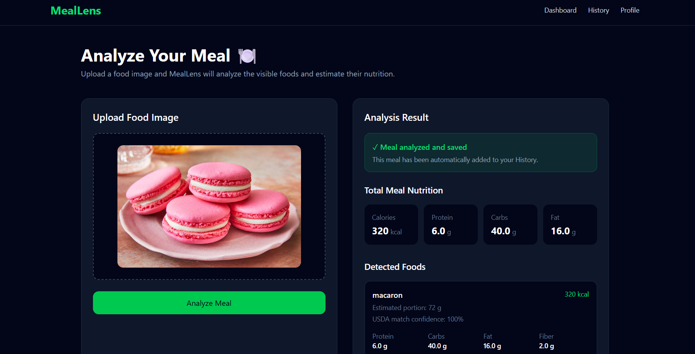
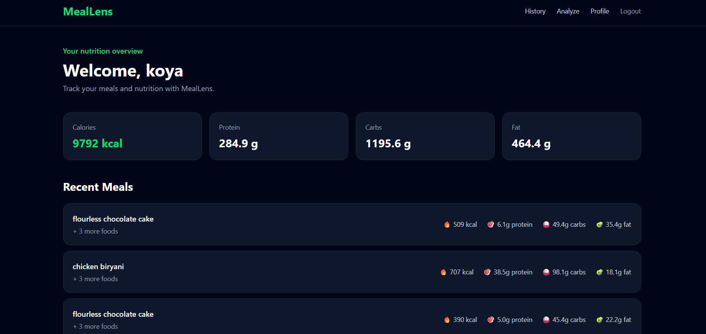

# MealLens 🍽️

**AI-Assisted Food & Nutrition Analysis Web Application**

MealLens is a full-stack web application that analyzes food images and provides **estimated nutritional information**, including calories, protein, carbohydrates, fat, fiber, sugar, and sodium.

It also provides meal history, dashboards, and nutrition insights to help users track their meals over time.

> **Note:** Nutrition values generated by MealLens are estimates. Results can vary depending on food recognition, ingredients, preparation method, and portion size. The project is intended as an AI-assisted estimation tool, not a medical or dietary diagnostic system.

---

## ✨ Features

* 📷 Food image analysis
* 🥗 AI-assisted nutrition estimation
* 🔥 Calorie estimation
* 💪 Protein, carbohydrate, and fat estimation
* 🌾 Fiber and sugar estimation
* 🧂 Sodium estimation
* 📊 Nutrition dashboard
* 📅 Meal history
* 📈 Nutrition insights
* 👤 User profiles
* 🔐 User registration and login
* ⚙️ Application settings

---

## 🧠 How It Works

```text
        Food Image
             ↓
     AI Food Analysis
             ↓
   Food / Ingredient Detection
             ↓
    Nutrition Information
             ↓
      Estimated Portion
             ↓
     Nutrition Result
             ↓
      Meal History
             ↓
     Dashboard & Insights
```

MealLens combines AI-based image analysis with nutrition data to generate an estimated nutritional profile for a meal.

---

## 🛠️ Tech Stack

### Frontend

* React
* Vite
* JavaScript
* Tailwind CSS
* Axios

### Backend

* Python
* Flask
* Flask-SQLAlchemy
* REST API

### AI & Data

* Google Gemini
* USDA FoodData Central

### Database

* SQLite

---

## 📁 Project Structure

```text
MealLens/
│
├── backend/
│   ├── app.py
│   ├── .env.example
│   └── ...
│
├── public/
│
├── src/
│   ├── pages/
│   │   ├── Analyze.jsx
│   │   ├── Dashboard.jsx
│   │   ├── History.jsx
│   │   ├── Home.jsx
│   │   ├── Insights.jsx
│   │   ├── Login.jsx
│   │   ├── Profile.jsx
│   │   ├── ProfileSetup.jsx
│   │   ├── Register.jsx
│   │   └── Settings.jsx
│   │
│   ├── App.jsx
│   ├── api.js
│   └── ...
│
├── package.json
├── vite.config.js
├── .gitignore
└── README.md
```

---

## 🚀 Running Locally

### 1. Clone the repository

```bash
git clone https://github.com/kohila-priya/MealLens.git
cd MealLens
```

### 2. Frontend setup

Install the frontend dependencies:

```bash
npm install
```

Create a `.env` file in the project root:

```env
VITE_API_URL=http://127.0.0.1:5000
```

Start the frontend:

```bash
npm run dev
```

The frontend will run on the Vite development server.

---

### 3. Backend setup

Move into the backend:

```bash
cd backend
```

Create and activate a Python virtual environment:

```bash
python -m venv venv
```

Activate it on Windows:

```powershell
venv\Scripts\activate
```

Install the dependencies:

```bash
pip install -r requirements.txt
```

Create `backend/.env`:

```env
GEMINI_API_KEY=your_gemini_api_key
USDA_API_KEY=your_usda_api_key
DATABASE_URL=sqlite:///meallens.db
CORS_ORIGINS=http://localhost:5173
HOST=0.0.0.0
PORT=5000
FLASK_DEBUG=false
```

Start the Flask backend:

```bash
python app.py
```

> Never commit your actual API keys or `.env` files. Use `.env.example` as a template.

---

## ⚠️ Current Limitations

MealLens currently provides **AI-assisted estimates**, rather than guaranteed nutritional measurements.

Accuracy can be affected by:

* Food recognition
* Portion-size estimation
* Ingredients used
* Cooking method
* Mixed dishes
* Variations between nutrition databases

For example, visually similar dishes can have substantially different nutritional values depending on their ingredients and preparation.

---

## 🔮 Future Improvements

Planned improvements include:

* Improved food recognition
* Better portion-size estimation
* Stronger nutrition-data verification
* Automated sanity checks for unusual nutrition estimates
* Confidence scoring
* Improved handling of mixed dishes
* More robust nutrition validation
* Production database support
* Cloud deployment

---


## 📸 Screenshots

### 🏠 Home



### 🔐 Login



### 🔍 Food & Nutrition Analysis



### 📊 Dashboard



---

## 📌 Project Status

**Active development**

MealLens is currently being developed as a full-stack AI-assisted nutrition analysis application.

---

## 👩‍💻 Author

**Kohila Priya**

GitHub: [@kohila-priya](https://github.com/kohila-priya)
